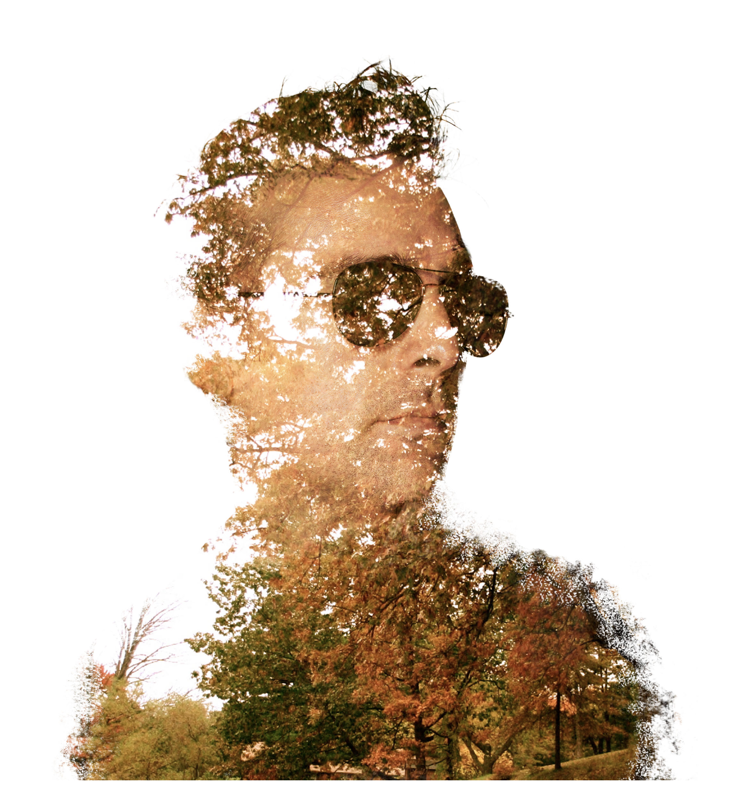
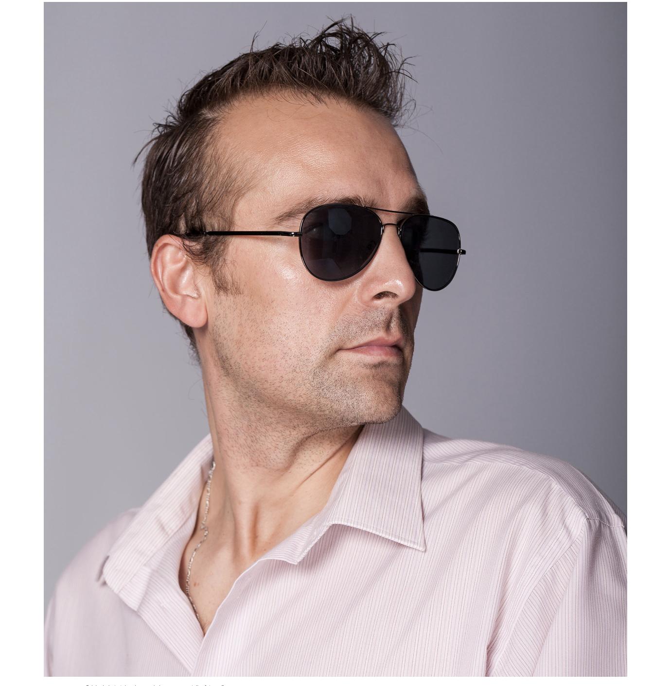
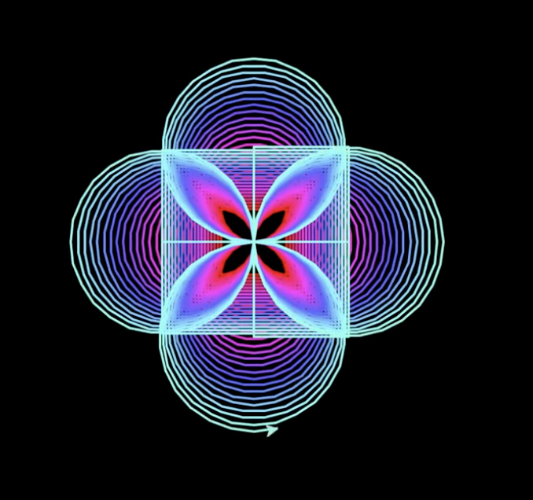
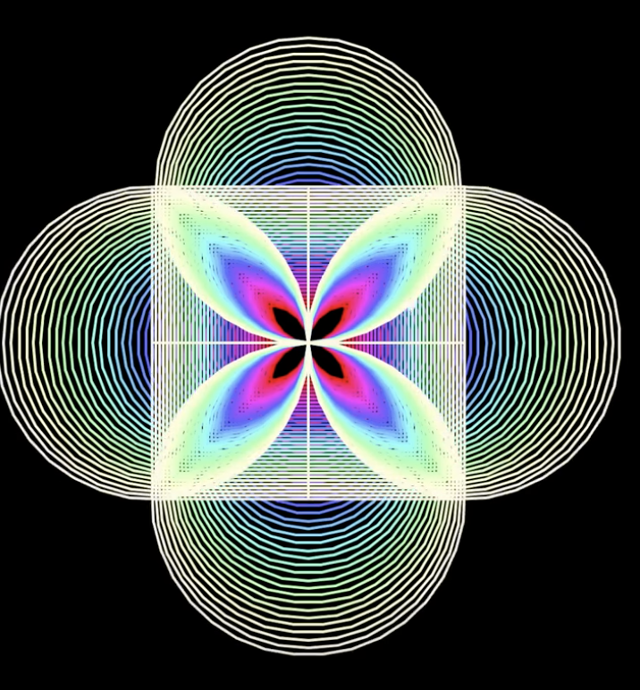
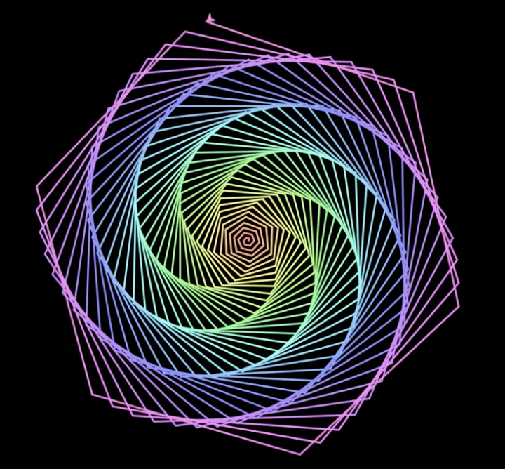
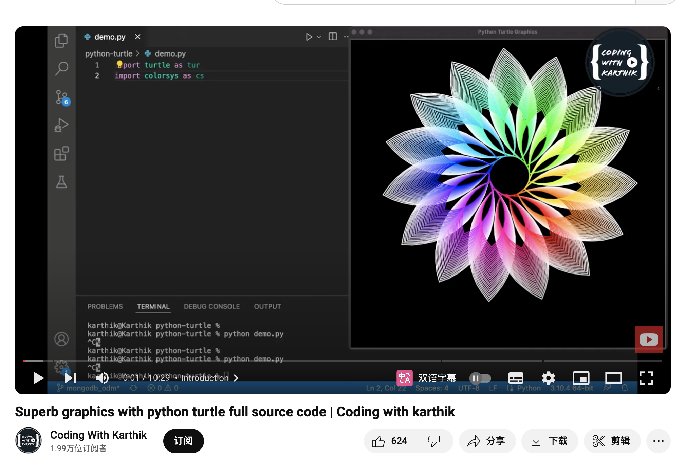

# ygon0450_9103_Quiz8

## Imaging Technique Inspiration
I have chosen an imaging technique widely used in photography, known as “double exposure”. This technique combines two different images into a single frame, creating an overlay effect that blends the elements of the two images together. Due to the assignment requirements, I aim to design the selected artwork without altering its main features, using this technique to effectively integrate and express this viewpoint. I plan to use actual landscapes similar to the artwork to blend with it and add special effects, creating distinctive visual effects.

 
  

## Coding Technique Exploration
Based on the imaging technology I have chosen, I need to use Python for creation. From my research in Python, I plan to transform this imaging technique into an abstract concept, utilising colour gradient effects to emphasise the layering of the work. I will add exposure effects to the artwork by gradually transitioning the colours from light to dark. Additionally, I will employ multiple overlapping effects to blend different elements together to achieve the final effect.

### Link to Code Tutorial
[Link Text](https://www.youtube.com/watch?v=-k-m2IGTTXs)

[Link Text](https://www.youtube.com/@CodingWithKarthik/shorts)

### Coding technique Screenshot
 
 
 
 

